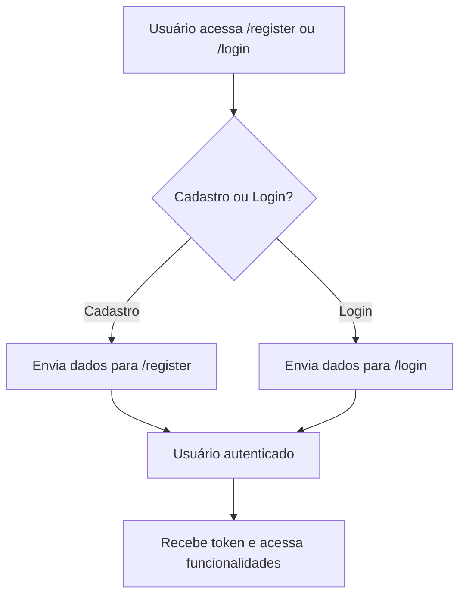
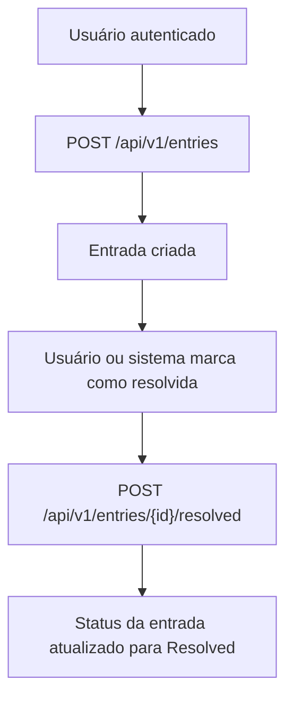
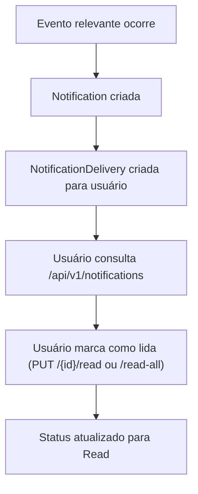
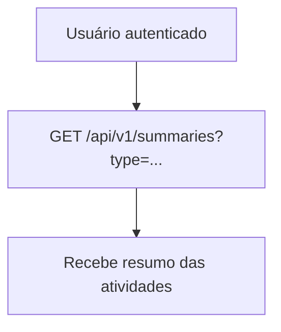

# Documentação da API LogBook

## O que é a API LogBook?

A API LogBook é um sistema para registro, acompanhamento e notificação de eventos, tarefas, bugs e melhorias em projetos. Ela permite que usuários registrem entradas (entries), acompanhem seu status, recebam notificações e obtenham resumos periódicos das atividades. O sistema é voltado para equipes de desenvolvimento, gestores de projetos e qualquer contexto onde o acompanhamento de atividades e notificações seja relevante.

---

## Funcionalidades Principais

- **Autenticação e Registro de Usuários**
  - Registro de usuários (tradicional e via login externo)
  - Login de usuários (tradicional e externo)
- **Gestão de Entradas (Entries)**
  - Criação de entradas (bugs, features, melhorias, tarefas)
  - Busca e filtragem de entradas por título, tags, categoria e status
  - Marcação de entradas como resolvidas
  - Consulta de entrada por ID
- **Notificações**
  - Listagem de notificações do usuário
  - Marcação de notificações como lidas (individual ou todas)
- **Resumos**
  - Geração de resumos periódicos (diário, semanal, etc.) das atividades
- **Permissões**
  - Controle de acesso a funcionalidades via permissões

---

## Entidades e Relacionamentos

### 1. User (Usuário)
- **Campos:** Id, ExternalId, Email, Username, FullName, PasswordHash, AvatarUrl, Bio
- **Relacionamentos:** Pode criar várias Entries, recebe Notifications

### 2. Entry (Entrada)
- **Campos:** Id, Title, Description, UserId, Category, Tags, Status, ResolvedAt
- **Relacionamentos:** Pertence a um User

### 3. Notification (Notificação)
- **Campos:** Id, Title, EventId, UserId, Type, Version, Metadata
- **Relacionamentos:** Relacionada a um User, pode ter várias NotificationDeliveries

### 4. NotificationDelivery (Entrega de Notificação)
- **Campos:** Id, NotificationId, RecipientId, Channel, SentOnUtc, IsRead, ReadOnUtc, Status, ErrorMessage, Preview
- **Relacionamentos:** Relacionada a uma Notification

### 5. NotificationSchedule (Agendamento de Notificação)
- **Campos:** Id, NotificationId, Frequency, ScheduledTime, DaysOfWeek, Channels
- **Relacionamentos:** Relacionada a uma Notification

#### Enums Importantes
- **EntryCategory:** Bug, Feature, Improvement, Task
- **EntryStatus:** Open, Resolved, InProgress
- **NotificationType:** Welcome, Reminder
- **NotificationChannel:** InApp, Email, Push
- **NotificationFrequency:** Once, Daily, Weekly, Immediate
- **NotificationStatus:** Pending, Sent, Read, Failed

---

## Endpoints Principais

### Usuários
- `POST /api/v1/users/register` — Registro de usuário
- `POST /api/v1/users/login` — Login tradicional
- `POST /api/v1/users/login/external` — Login externo

### Entradas
- `POST /api/v1/entries` — Criação de entrada
- `GET /api/v1/entries` — Busca de entradas (filtros: título, tags, categoria, status, paginação)
- `POST /api/v1/entries/{id}/resolved` — Marcar entrada como resolvida
- `GET /api/v1/entries/{id}` — Buscar entrada por ID

### Notificações
- `GET /api/v1/notifications` — Listar notificações do usuário
- `PUT /api/v1/notifications/{id}/read` — Marcar notificação como lida
- `PUT /api/v1/notifications/read-all` — Marcar todas notificações como lidas

### Resumos
- `GET /api/v1/summaries` — Obter resumo das atividades (por tipo)

---

## Personas

### 1. Usuário Comum
- Registra e consulta entradas
- Recebe e gerencia notificações
- Consulta resumos de atividades

### 2. Usuário Externo (OAuth)
- Acessa via login externo (ex: GitHub)
- Tem as mesmas permissões do usuário comum

### 3. Gestor/Administrador (futuro)
- Poderá ter permissões diferenciadas para relatórios, gestão de usuários, etc. (a ser implementado)

---

## Fluxogramas de Uso

### 1. Fluxo de Registro e Login

### 2. Fluxo de Criação e Resolução de Entrada

### 3. Fluxo de Notificações

### 4. Fluxo de Resumos

---

## Permissões

Atualmente, a permissão principal é `users:access`, que controla o acesso a funcionalidades protegidas (ex: notificações). O sistema está preparado para evoluir para múltiplos papéis e permissões.

---

## Resumo

A API LogBook é uma solução robusta para registro, acompanhamento e notificação de atividades, com foco em flexibilidade, notificações multicanal e integração com provedores externos de autenticação. É ideal para equipes que desejam rastrear tarefas, bugs e eventos, mantendo todos informados e organizados.

