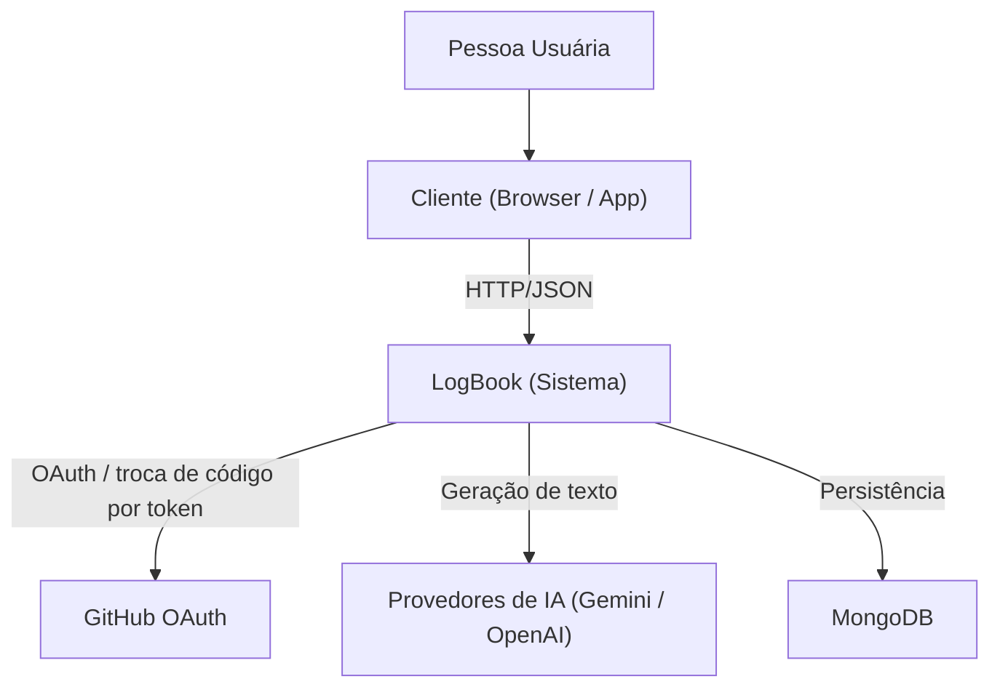
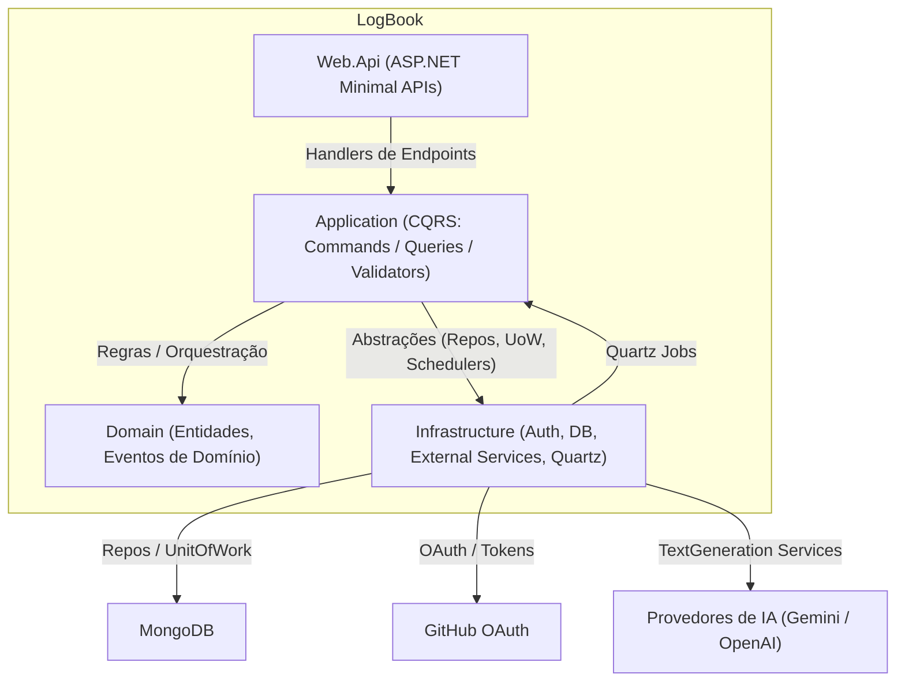
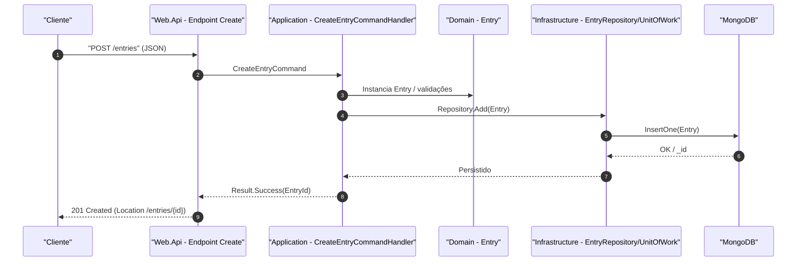

## Arquitetura do Sistema LogBook

### Modelagem dos componentes e fluxos de dados

- **Web.Api**: Endpoints HTTP (Minimal APIs) em `Web.Api/Endpoints/*`. Converte requests em `Commands/Queries` do Application e mapeia `Result` para respostas HTTP.
- **Application**: Implementa CQRS (`ICommand/ICommandHandler`, `IQuery/IQueryHandler`), validações (`ValidationPipelineBehavior`), logging (`RequestLoggingPipelineBehavior`). Orquestra casos de uso e chama abstrações de repositórios/serviços.
- **Domain**: Entidades e regras (e.g., `Entry`, `Notification`, `User`), eventos de domínio, contratos de repositório/serviços. Não conhece infraestrutura.
- **Infrastructure**: Implementações concretas (MongoDB Repositories, OAuth GitHub, TokenProvider, PasswordHasher, Serviços de IA, Quartz Scheduler). Integra com bancos e sistemas externos.
- **SharedKernel**: Tipos transversais (`Entity`, `Result`, `Error`, `PagedList`, etc.) e contratos utilitários (`IDateTimeProvider`, `IDomainEvent`).

- **Fluxos principais (exemplos)**
  - **Criar Entrada**: Web.Api → `CreateEntryCommand` → valida/instancia `Entry` → `EntryRepository.Add` → MongoDB → `201 Created`.
  - **Buscar Entradas**: Web.Api → `SearchEntryQuery` → filtros/paginação → `EntryRepository.Search` → MongoDB → `PagedList`.
  - **Autenticação**: Web.Api → `LoginUserCommand`/`RegisterUserCommand`/`RegisterExternalUserCommand` → `UserRepository` + `PasswordHasher`/`GithubOAuthProvider` → `TokenProvider` → JWT.
  - **Notificações**: `NotificationScheduler` agenda → `SendNotificationJob` processa `NotificationSchedule` → cria `NotificationDelivery` → atualiza status.
  - **Sumários**: `SummaryPeriodQueryHandler` usa `SummaryEntryService` → agrega entradas por período → retorna texto (pode usar serviços de IA via `TextGenerationServiceSelector`).

### Definição das camadas da aplicação

- **Apresentação (Web.Api)**
  - Responsabilidades: endpoints, autenticação/autorização no pipeline HTTP, serialização, mapeamento para `Result`.
  - Depende de: `Application`.
  - Não contém regras de negócio nem acesso direto a dados.

- **Aplicação (Application)**
  - Responsabilidades: orquestra casos de uso (CQRS), validações, logging, transações (via `UnitOfWork`), despacho de eventos.
  - Depende de: `Domain`, `SharedKernel`. Expõe abstrações para Infra.
  - Não conhece detalhes de persistência nem integrações externas.

- **Domínio (Domain)**
  - Responsabilidades: entidades, invariantes, regras, eventos, contratos de repositório/serviços.
  - Depende de: `SharedKernel`.
  - Não referencia `Application`/`Infrastructure`.

- **Infraestrutura (Infrastructure)**
  - Responsabilidades: implementação de repositórios, integrações externas (OAuth, IA), agendamento (Quartz), provedor de tempo.
  - Depende de: `Domain`, `Application.Abstractions`, `SharedKernel`.
  - Não contém regras de negócio.

- **Núcleo compartilhado (SharedKernel)**
  - Responsabilidades: padrões táticos (`Entity`, `Result`), erros, paginação, contratos utilitários.

- **Regras de dependência (camadas)**
  - `Web.Api` → `Application`
  - `Application` → `Domain`, `SharedKernel`
  - `Domain` → `SharedKernel`
  - `Infrastructure` → `Domain`, `Application.Abstractions`, `SharedKernel`

## C4 Model

### Nível 1 — Contexto

### Nível 2 — Contêineres

### Diagrama de Sequência — Criar Entrada

